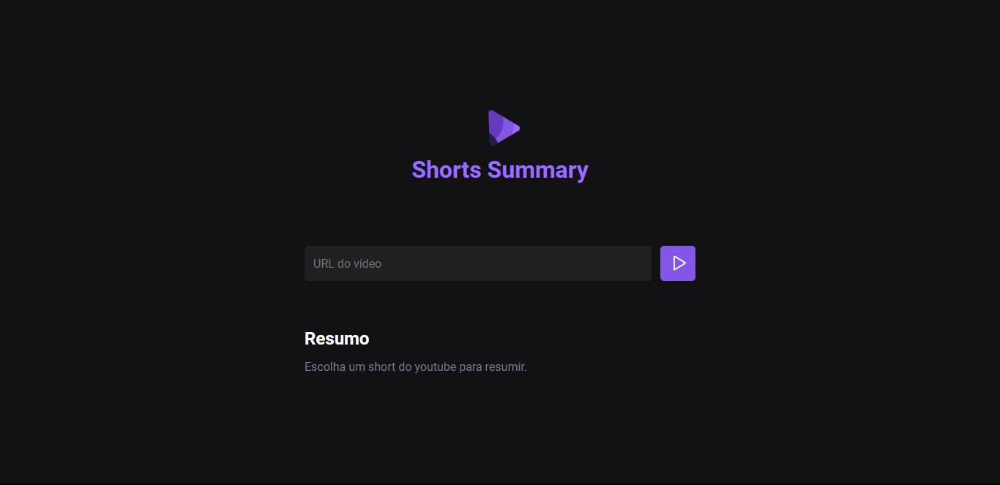

# 🤖 NLW - IA 🤖
>Trilha Foundations

# Projeto 
> Construído no evento Next Level Week da Rocketseat. Aplicação que possibilita através de uma URL de shorts do youtube, por meio de IA, obter um resumo do vídeo. 

[🔗Clique aqui para acessar](https://alefemendes.github.io/mini-potifolio-mapadev-week-2/)

## 🌐 Tecnologias 💻

- HTML  
- CSS
- JavaScript
- GitHub

## 📲 Contato 📲

alefe.o.mendes_23@outlook.com